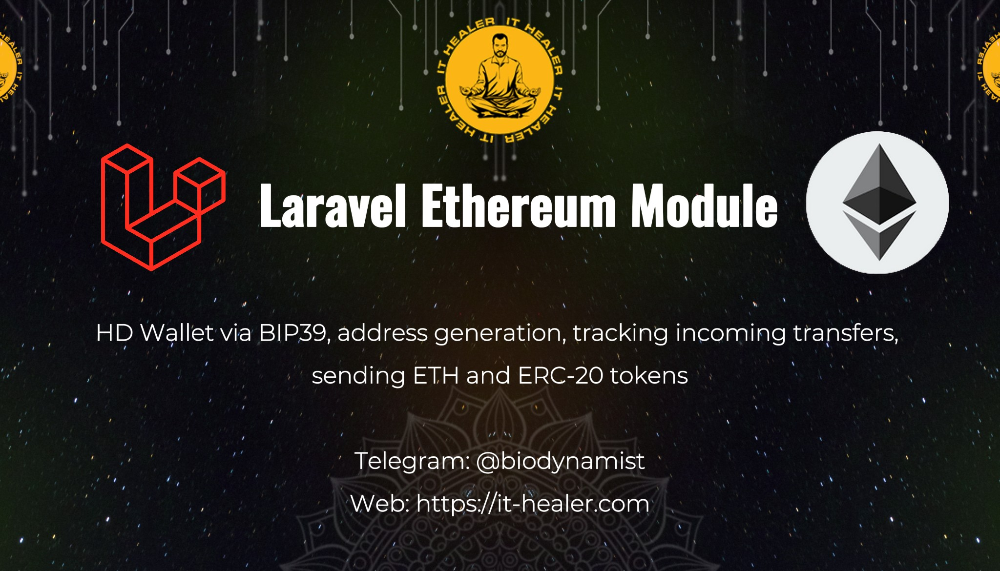

<a href="https://packagist.org/packages/it-healer/laravel-ethereum" target="_blank">
    
</a>

<a href="https://packagist.org/packages/it-healer/laravel-ethereum" target="_blank">
    
</a>

**Laravel Ethereum Module** is a Laravel package for work with cryptocurrency Ethereum, with the support ERC-20 tokens. It allows you to generate HD wallets using mnemonic phrase, validate addresses, get addresses balances and resources, preview and send ETH/ERC-20 tokens. You can automate the acceptance and withdrawal of cryptocurrency in your application.

## Requirements

The following versions of PHP are supported by this version.

* PHP 8.2 and older
* Laravel 10 or older
* PHP Extensions: GMP, BCMath, CType.

## Installation
You can install the package via composer:
```bash
composer require it-healer/laravel-ethereum
```

After you can run installer using command:
```bash
php artisan ethereum:install
```

And run migrations:
```bash
php artisan migrate
```

Register Service Provider and Facade in app, edit `config/app.php`:
```php
'providers' => ServiceProvider::defaultProviders()->merge([
    ...,
    \ItHealer\LaravelEthereum\EthereumServiceProvider::class,
])->toArray(),

'aliases' => Facade::defaultAliases()->merge([
    ...,
    'Ethereum' => \ItHealer\LaravelEthereum\Facades\Ethereum::class,
])->toArray(),
```

For Laravel 10 you edit file `app/Console/Kernel` in method `schedule(Schedule $schedule)` add:
```php
$schedule->command('ethereum:sync')
    ->everyMinute()
    ->runInBackground();
```

or for Laravel 11+ add this content to `routes/console.php`:

```php
use Illuminate\Support\Facades\Schedule;

...

Schedule::command('ethereum:sync')
    ->everyMinute()
    ->runInBackground();
```

## Examples
First you need to add Ethereum Nodes, you can register account in <a href="https://www.ankr.com/rpc/">ANKR.COM</a> get take HTTPS Endpoint with API key for Ethereum blockchain:
```php
use \ItHealer\LaravelEthereum\Facades\Ethereum;

Ethereum::createNode('My node', 'https://rpc.ankr.com/eth/{API_KEY}');
```

Second you need add Ethereum Explorer, you can register account in <a href="https://etherscan.io/apis">Etherscan.io API</a> and take Endpoint with API key:
```php
use \ItHealer\LaravelEthereum\Facades\Ethereum;

Ethereum::createExplorer('My explorer', 'https://api.etherscan.io/api', '{API_KEY}');
```

You can create ERC-20 Token:
```php
use \ItHealer\LaravelEthereum\Facades\Ethereum;

$contractAddress = '0xdac17f958d2ee523a2206206994597c13d831ec7';
Ethereum::createToken($contractAddress);
```

Now you can create new Wallet:
```php
use \ItHealer\LaravelEthereum\Facades\Ethereum;

$wallet = Ethereum::createWallet('My wallet');
```

## Support

- Telegram: [@biodynamist](https://t.me/biodynamist)
- WhatsApp: [+905516294716](https://wa.me/905516294716)
- Web: [it-healer.com](https://it-healer.com)

## Changelog

Please see [CHANGELOG](CHANGELOG.md) for more information on what has changed recently.

## Credits

- [IT-HEALER](https://github.com/it-healer)

## License

The MIT License (MIT). Please see [License File](LICENSE.md) for more information.

