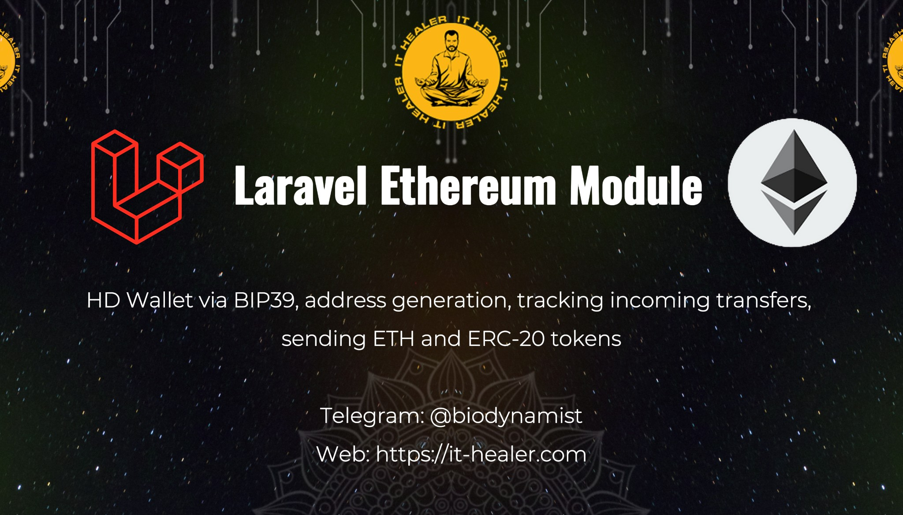

<a href="https://packagist.org/packages/it-healer/laravel-ethereum" target="_blank">
    
</a>

<a href="https://packagist.org/packages/it-healer/laravel-ethereum" target="_blank">
    
</a>

**Laravel Ethereum Module** is a Laravel package for work with cryptocurrency Ethereum, with the support ERC-20 tokens. It allows you to generate HD wallets using mnemonic phrase, validate addresses, get addresses balances and resources, preview and send ETH/ERC-20 tokens. You can automate the acceptance and withdrawal of cryptocurrency in your application.

## Requirements

The following versions of PHP are supported by this version.

* PHP 8.2 and older
* Laravel 10 or older
* PHP Extensions: GMP, BCMath, CType.

## Installation
You can install the package via composer:
```bash
composer require it-healer/laravel-ethereum
```

After you can run installer using command:
```bash
php artisan ethereum:install
```

And run migrations:
```bash
php artisan migrate
```

Register Service Provider and Facade in app, edit `config/app.php`:
```php
'providers' => ServiceProvider::defaultProviders()->merge([
    ...,
    \ItHealer\LaravelEthereum\EthereumServiceProvider::class,
])->toArray(),

'aliases' => Facade::defaultAliases()->merge([
    ...,
    'Ethereum' => \ItHealer\LaravelEthereum\Facades\Ethereum::class,
])->toArray(),
```

For Laravel 10 you edit file `app/Console/Kernel` in method `schedule(Schedule $schedule)` add:
```php
$schedule->command('ethereum:sync')
    ->everyMinute()
    ->runInBackground();
```

or for Laravel 11+ add this content to `routes/console.php`:

```php
use Illuminate\Support\Facades\Schedule;

...

Schedule::command('ethereum:sync')
    ->everyMinute()
    ->runInBackground();
```

## Examples
First you need to add Ethereum Nodes, you can register account in <a href="https://www.ankr.com/rpc/">ANKR.COM</a> get take HTTPS Endpoint with API key for Ethereum blockchain:
```php
use \ItHealer\LaravelEthereum\Facades\Ethereum;

Ethereum::createNode('My node', 'https://rpc.ankr.com/eth/{API_KEY}');
```

Second you need add Ethereum Explorer, you can register account in <a href="https://etherscan.io/apis">Etherscan.io API</a> and take Endpoint with API key:
```php
use \ItHealer\LaravelEthereum\Facades\Ethereum;

Ethereum::createExplorer('My explorer', 'https://api.etherscan.io/api', '{API_KEY}');
```

You can create ERC-20 Token:
```php
use \ItHealer\LaravelEthereum\Facades\Ethereum;

$contractAddress = '0xdac17f958d2ee523a2206206994597c13d831ec7';
Ethereum::createToken($contractAddress);
```

Now you can create new Wallet:
```php
use \ItHealer\LaravelEthereum\Facades\Ethereum;

$wallet = Ethereum::createWallet('My wallet');
```

### Custom derivation path

Different wallets use different BIP-44 paths. The path template is stored per wallet
(the `{index}` placeholder is replaced with the address index); the default is the
standard `m/44'/60'/0'/0/{index}` used by MetaMask and most software wallets, so
existing wallets and projects are not affected.

```php
use \ItHealer\LaravelEthereum\Ethereum as EthereumCore;
use \ItHealer\LaravelEthereum\Facades\Ethereum;

// Ledger Live: m/44'/60'/{index}'/0/0
$wallet = Ethereum::createWallet('Ledger', derivationPath: EthereumCore::PATH_LEDGER_LIVE);

// Ledger Legacy / MyEtherWallet: m/44'/60'/0'/{index}
$wallet = Ethereum::createWallet('Old Ledger', derivationPath: EthereumCore::PATH_LEDGER_LEGACY);

// Any custom template
$wallet = Ethereum::createWallet('Custom', derivationPath: "m/44'/60'/1'/0/{index}");
```

The default template can be changed via `config('ethereum.wallet.default_derivation_path')`.

## Adaptive synchronization (touch)

Enable adaptive sync (`ethereum.touch`) so addresses are polled **often while in use and rarely
while idle**, instead of every run. An address is "active" for `waiting_seconds` after its last
`touch_at` (set on user/merchant activity); while active it syncs no more often than
`fast_interval`, while idle no more often than `slow_interval`.

```php
// config/ethereum.php
'touch' => [
    'enabled' => true,
    'waiting_seconds' => 1800,  // stay "active" 30 min after last touch
    'fast_interval' => 60,      // while active: at most once per 60s
    'slow_interval' => 3600,    // while idle: at most once per hour (null = skip idle entirely)
],
```

Mark activity by updating `touch_at` when the wallet is used (GUI view, API call, unlock):

```php
$address->update(['touch_at' => now()]);
// or in bulk for a wallet:
$wallet->addresses()->update(['touch_at' => now()]);
```

Defaults (`fast_interval` 0, `slow_interval` null) preserve the legacy behavior: active addresses
sync every run, idle ones are skipped. `ethereum:address-sync --force` bypasses the schedule.

## Alchemy support

Alchemy can be used both as an **RPC node** and as a **transaction-history explorer**
(`alchemy_getAssetTransfers`), and for **real-time deposits** via Address Activity webhooks.

```php
// RPC node + Alchemy explorer (drop-in alternative to Etherscan)
Ethereum::createAlchemyNode(apiKey: 'YOUR_ALCHEMY_KEY', name: 'alchemy');
Ethereum::createAlchemyExplorer(apiKey: 'YOUR_ALCHEMY_KEY', name: 'alchemy');
```

The explorer is driver-based (`ethereum_explorers.driver` = `etherscan_v2` | `alchemy`); the
sync, deposits and webhook handler are unchanged. The chain is taken from
`config('ethereum.explorer.chain_id')` (1 = mainnet, 11155111 = Sepolia).

### Compute Units & load balancing

Every node/explorer request is metered in a `credits` counter (Compute Units) that resets monthly;
`getNode()`/`getExplorer()` pick the least-used one, spreading load and Alchemy CU spend. CU costs
come from `ItHealer\LaravelEthereum\Services\Alchemy\ComputeUnits` (override in
`config('ethereum.compute_units')`). Set `ethereum.sync.track_outgoing=false` to detect deposits only
and halve `getAssetTransfers` requests.

### Real-time deposits (Address Activity webhooks)

```dotenv
ETHEREUM_ALCHEMY_NOTIFY_AUTH_TOKEN=your-notify-auth-token   # dashboard → Webhooks → AUTH TOKEN
ETHEREUM_ALCHEMY_WEBHOOK_ENABLED=true
ETHEREUM_ALCHEMY_WEBHOOK_URL=https://your-app.com/ethereum/alchemy/webhook
ETHEREUM_ALCHEMY_AUTO_SUBSCRIBE=true
```

```bash
php artisan ethereum:alchemy-setup --reconcile   # create the webhook + subscribe existing addresses
php artisan ethereum:alchemy-reconcile           # sync watched-address list
php artisan ethereum:confirm-deposits            # mature confirmations (webhooks fire once)
```

Alchemy pushes a signed notification on incoming/outgoing activity; the package verifies the HMAC
signature and triggers a targeted `AddressSync`. Facade API: `Ethereum::ensureAlchemyWebhook()`,
`subscribeAlchemyAddress()`, `unsubscribeAlchemyAddress()`, `reconcileAlchemyWebhook()`.

## Support

- Telegram: [@biodynamist](https://t.me/biodynamist)
- WhatsApp: [+905516294716](https://wa.me/905516294716)
- Web: [it-healer.com](https://it-healer.com)

## Changelog

Please see [CHANGELOG](CHANGELOG.md) for more information on what has changed recently.

## Credits

- [IT-HEALER](https://github.com/it-healer)

## License

The MIT License (MIT). Please see [License File](LICENSE.md) for more information.

